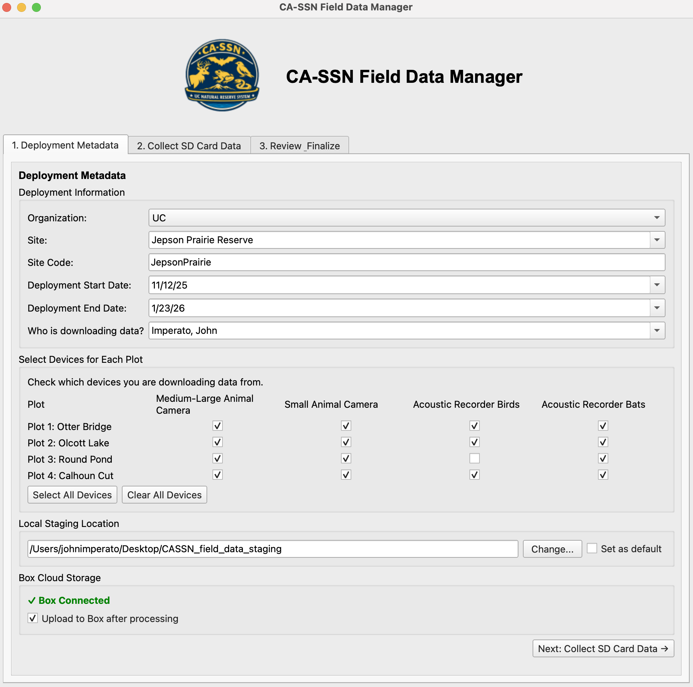
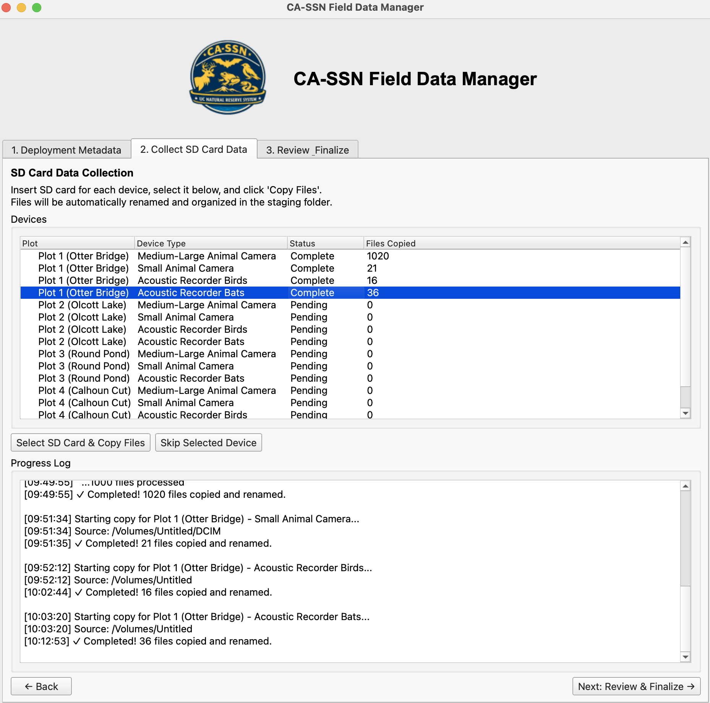
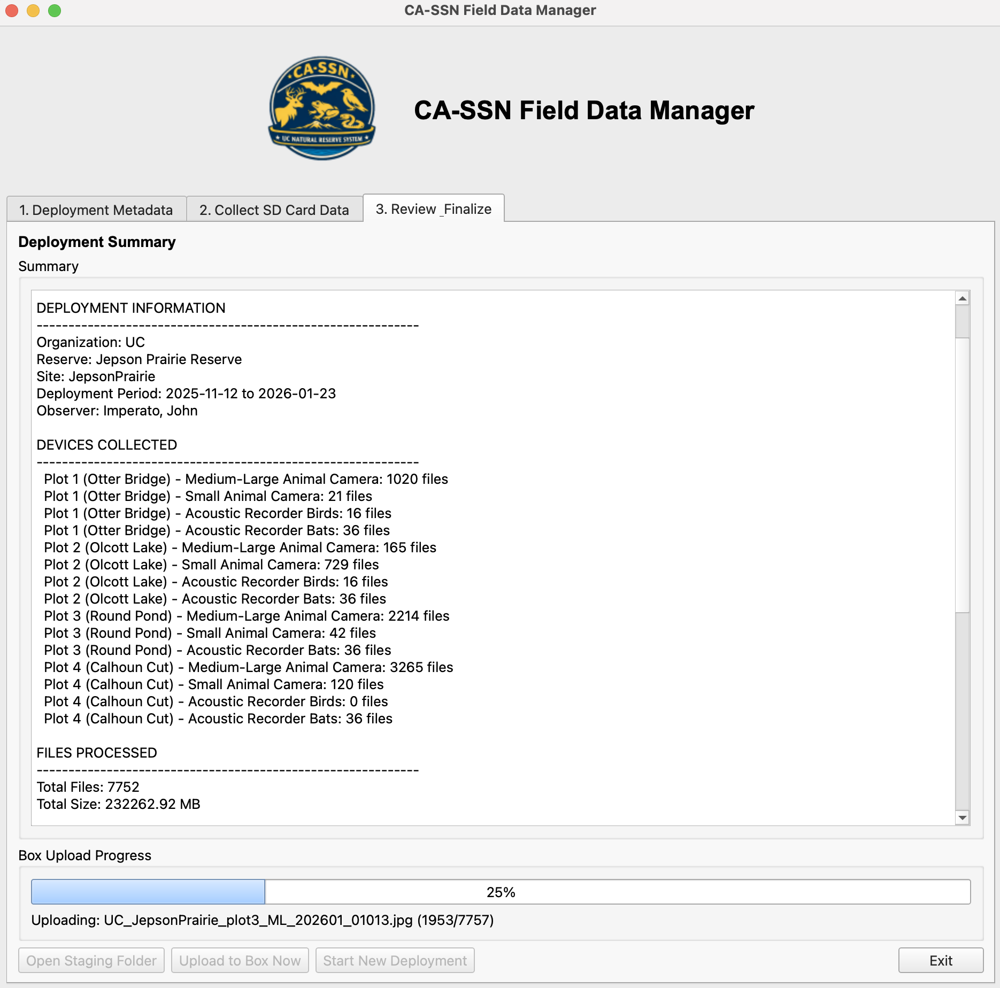

# CA-SSN Field Data Manager

A Python desktop application for downloading, uploading, and managing wildlife image and audio data. Built for the California Sentinel Sites for Nature (CA-SSN) program — standardized biodiversity data collected with camera traps and acoustic recorders across California reserves and partner organizations.


## Features

- **Guided Workflow**: Step-by-step interface for SD card download and cloud storage upload across multi-plot, multi-device deployments
- **Parallel Card Ingestion**: Copy one to four device cards concurrently. Each card has independent progress, speed/ETA, warnings, cancellation, and a rolling slot that becomes reusable as soon as that card is safely checkpointed.
- **Standardized File Naming**: Files renamed to a consistent convention (`ORG_SITE_plotN_DEVTYPE_YYYYMMDD_SEQNO.ext`) for all devices. Camera images additionally encode trigger event and burst position (`EVENTNO_POS`) so photos from the same trigger are grouped.
- **Per-file Metadata Generation**: Two CSVs written per deployment: `image_file_metadata.csv` (camera trap files) and `audio_file_metadata.csv` (AudioMoth recordings and config files). See the Metadata Schema section below for full field lists.
- **Deployment Records**: Deployment configuration and file manifest saved as JSON for each session.
- **Data Provenance**: Each metadata row records app version, processing timestamp, and Box upload status (uploader + datetime). Provenance CSVs are automatically re-uploaded to Box after the upload completes.
- **Data Integrity**: SHA-256 and SHA-1 checksums recorded for each file. SHA-256 is the primary archival checksum; SHA-1 supports fast comparison with Box-reported hashes.
- **AudioMoth Parsing**: Recording schedule, gain, filter cutoff, and sample rate extracted from CONFIG.TXT; per-file battery voltage, temperature, and gain parsed from WAV comment headers.
- **Reconyx MakerNote Parsing**: Sequence position, trigger type (Motion/Time-lapse), sequence total, ambient temperature, moon phase, battery voltage, and battery type extracted directly from Reconyx HYPERFIRE HP4K EXIF MakerNote via ExifTool.
- **Device Identification**: Event identity and dates come from `deployment_events.csv`; each card is bound to one exact monitoring interval in `deployments.csv`. AudioMoth IDs read from the card are used when present and the deployment row supplies the fallback when CONFIG.TXT is absent.
- **Timestamps**: `recorded_datetime` stored as ISO 8601 with UTC offset (e.g. `2025-12-04T15:48:05-08:00`), sourced from EXIF for cameras and AudioMoth filename for audio; DST-aware via `zoneinfo`
- **Cloud Storage**: Upload to Box with progress tracking and OAuth token refresh. Transfers are started by hand from the grouped action menus on the final tab — nothing uploads on its own.
- **Multi-Format File Support**: Images (JPG, PNG, TIF, RAW), audio (WAV, MP3, FLAC)
- **Lookup Authority**: Manually curated `deployment_events.csv` and `deployments.csv` are distributed with the complete Box `app_config` snapshot. Every app installation validates the snapshot before replacing its offline cache.
- **Wildlife Insights Export**: Generates deployment CSVs formatted for upload to Wildlife Insights from `image_file_metadata.csv`, using event-scoped camera metadata from `deployments.csv` and defaults from `wi_config.json`.
- **Wildlife Insights Image Batching**: Before the first Box upload, camera folders above 15,000 images are automatically organized into verified, burst-preserving numbered parts. The operation is visible, cancellable, and resumable.
- **SoundHub-Ready Audio Metadata**: `audio_file_metadata.csv` fields map directly to SoundHub deployment template columns — gain, filter cutoff (kHz), recording schedule, ARU hardware setup — so no field renaming is needed at submission time.
- **Wildlife SoundHub Submission**: Bird audio is transcoded to lossless FLAC into a local tree mirroring SoundHub's S3 bucket, with `deployment.csv` and `recording.csv` projected from `audio_file_metadata.csv`, then uploaded and verified. Box keeps the original WAVs untouched. See the Wildlife SoundHub Preparation section.
- **Session Persistence**: Interrupted downloads resume automatically. Concurrent workers checkpoint through one session writer; previously copied files are skipped and sequence/event numbering continues correctly.

## Installation

### Prerequisites

- Python 3.9 or higher
- pip package manager

### Install Dependencies

```bash
pip install -r requirements.txt
```

Reconyx MakerNote extraction also requires the **ExifTool** command-line program
(`PyExifTool` is only a Python wrapper around it). Install the binary separately:

```bash
# macOS
brew install exiftool
# Debian/Ubuntu
sudo apt install libimage-exiftool-perl
```

If ExifTool isn't available the app still runs — it simply skips the Reconyx
extras (temperature, moon phase, battery) and the ExifTool sequence fallback.

Preparing bird audio for Wildlife SoundHub requires the **FLAC** encoder. It is
only needed for that step; without it the rest of the app is unaffected.

```bash
# macOS
brew install flac
# Debian/Ubuntu
sudo apt install flac
```

### Download

Clone this repository:

```bash
git clone https://github.com/Sentinel-Sites-for-Nature/cassn-field-data-manager.git
cd cassn-field-data-manager
```

### Configure Box Credentials

Box credentials live in `~/.cassn_config/`, a hidden folder in your home
directory, outside the repo so they are never accidentally committed to version
control. The app also caches synced lookup tables and Box tokens here.

Create the folder and config file:

```bash
mkdir -p ~/.cassn_config
cp config.json.example ~/.cassn_config/config.json
```

Edit `~/.cassn_config/config.json` and add your Box application credentials and
folder IDs:

```json
{
  "box": {
    "client_id": "YOUR_BOX_CLIENT_ID",
    "client_secret": "YOUR_BOX_CLIENT_SECRET",
    "field_data_folder_id": "YOUR_CASSN_FIELD_DATA_FOLDER_ID",
    "app_config_folder_id": "YOUR_CASSN_APP_CONFIG_FOLDER_ID"
  }
}
```

- **`field_data_folder_id`** — the Box folder uploads are written to.
- **`app_config_folder_id`** — the canonical Box folder containing sites,
  plots, JSON defaults, `deployment_events.csv`, and `deployments.csv`.

Lock down the folder permissions so only you can read it:

```bash
chmod 700 ~/.cassn_config
chmod 600 ~/.cassn_config/config.json
```

**To get Box credentials:**
1. Go to https://app.box.com/developers/console
2. Create a new app (Custom App → OAuth 2.0)
3. Copy the Client ID and Client Secret
4. Navigate to each Box folder and copy its ID from the URL (e.g. `https://app.box.com/folder/123456789` → folder ID is `123456789`)

> For a managed program, the organization admin typically provides a ready-made
> `config.json` (client credentials + the two folder IDs) over a secure channel.
> Treat it like a password — never commit it or place it in a shared cloud folder.

## Usage

### 1. Box Authentication (First Time Setup)

After configuring `~/.cassn_config/config.json`, authenticate with Box
using the utility script:

```bash
python utils/box_auth_setup.py
```

Follow the prompts to:
- Open the Box authorization URL in your browser
- Grant access to the application
- Paste the full redirect URL back into the terminal

This creates or refreshes `~/.cassn_config/box_tokens.json`, which enables
automatic cloud uploads and lookup-table sync. No manual copy step is required.
For detailed Box utility documentation, see [`utils/README.md`](utils/README.md).
Box tokens expire after ~60 days of inactivity — re-run the command above to
refresh them.

### 2. Run the Application

```bash
cassn-app
```

`cassn-app` is a launcher symlinked from `~/.local/bin`. It changes to this
repository and runs `.venv/bin/python -m cassn`, so the application always uses
the tested project environment even when Conda or another Python installation
is active. To install the command on another workstation, make
`utils/cassn-app` executable and symlink it into a directory on that user's
`PATH`. The direct equivalent is:

```bash
.venv/bin/python -m cassn
```

On macOS, install or refresh a clickable copy in `~/Applications` with:

```bash
.venv/bin/python utils/install_macos_app.py --open
```

The resulting **CA-SSN Field Data Manager.app** uses the same repository and
virtual environment as `cassn-app`; it does not duplicate or freeze the Python
application. It also installs the `cassn-clear-staging` command. To retain the
application in the Dock, right-click its icon while it is open and choose
**Options → Keep in Dock**. Finder/Dock launches write diagnostics to
`~/Library/Logs/CA-SSN Field Data Manager/launcher.log`.

On launch the app first downloads the complete Box `app_config` snapshot to
temporary files. It validates `deployment_events.csv` and `deployments.csv`
together, validates their canonical event, site, plot, sequence, and interval
relationships, and only then
replaces the local cache. A fresh authenticated installation therefore
bootstraps entirely from Box. If Box is unavailable, the app continues only
when the complete local cache is valid and shows an offline-cache warning. If
neither source is valid, startup stops with instructions to reconnect or repair
the curated lookup files. Legacy camera/ARU files are never loaded.

### Validate curated lookup data

Before distributing a manually edited lookup snapshot, run the read-only
validator from the repository root:

```bash
.venv/bin/python utils/validate_curated_lookups.py /path/to/lookup_directory
```

The directory must contain the complete runtime snapshot, including
`sites.csv`, `plots.csv`, `deployment_events.csv`, `deployments.csv`, and the
required JSON configuration files. The validator
checks schemas, canonical event IDs and dates, site/plot/sequence relationships,
and deployment interval ordering. It never
copies, installs, or publishes files. Distribution to Box remains a deliberate
manual operation.

### 3. Workflow

For a sequential workflow diagram, see [`docs/workflow.md`](docs/workflow.md).

#### Step 1: Deployment Metadata
- Select your organization (driven by the synced `program_config.json`)
- Choose the formal site name from the dropdown; the stable short name and acronym fill automatically
- Choose a completed deployment event; its read-only dates and deployed devices load automatically
- Review the separate read-only summary of devices still deployed in the field
- Select who is downloading the data
- Check which devices (ML, SA, BD, BT) for each plot
- Configure local staging location (default: `~/Desktop/CASSN_field_data_staging`)

#### Step 2: Collect SD Card Data
- Insert SD card for each device
- Select the device from the list
- Click "Select SD Card & Copy Files" to copy, rename, and hash all files to local staging
- Repeat for all devices

#### Step 3: Review & Finalize
- Review deployment summary
- View file counts and sizes by device
- Before the first Box upload, oversized camera folders are automatically prepared in Wildlife Insights batches of at most 15,000 images
- Start transfers by hand from the grouped action menus at the bottom of the tab.
  Nothing uploads on its own:
  - **Uploads** — Box upload, and the two-step SoundHub path (prepare, then upload)
  - **QC Checks** — Box verification, Box↔local hashes, SoundHub verification
  - **Deployment** — open either staging folder, switch deployment, start a new one
- Start new deployment or exit

### Screenshots

#### Deployment Metadata Entry
Enter deployment information, select devices, and configure storage location.



#### SD Card Data Collection
Copy files from SD cards with automatic renaming and metadata extraction.



#### Review & Upload to Box
View deployment summary and upload to Box cloud storage.



## Output Structure

The application creates an organized folder structure in your staging location:

```
ORG_SITE_YYYYMMDD/
├── deployment_event_record.json        # Deployment event record (devices, file count, dates)
├── image_file_metadata.csv             # Per-file metadata for all camera trap images
├── audio_file_metadata.csv             # Per-file metadata for all AudioMoth recordings
├── qc/                                 # QC / audit sidecars (travel to Box with the data)
│   ├── qc_report.json                  # Full audit trail of every QC check
│   ├── box_upload_manifest.json        # Pre-upload manifest (reconciliation source)
│   ├── box_upload_verification.json    # Post-upload Box reconciliation report
│   ├── deployment_summary.txt          # Human-readable rollup of the deployment
│   └── lookup_snapshot/                # Lookup/config files snapshotted at metadata generation time
├── WI_metadata/                        # Wildlife Insights deployment CSVs
│   ├── wildlife_insights_ML_deployments.csv
│   └── wildlife_insights_SA_deployments.csv
└── raw_data/
    ├── p1_ML/                          # Plot 1, Medium-Large camera
    │   ├── UC_Bodega_plot1_ML_20260303_00001_1.jpg   # Flat when ≤15,000 images
    │   └── ...
    ├── p2_ML/                          # Oversized camera folder (>15,000 images)
    │   ├── p2_ML_1/                    # Numbered WI batch, ≤15,000 images
    │   │   └── ...
    │   └── p2_ML_2/                    # Trigger bursts are never split between batches
    │       └── ...
    ├── p1_BD/                          # Plot 1, Bird recorder
    │   ├── UC_Bodega_plot1_BD_20260303_00001.wav
    │   └── ...
    └── ...
```

### Wildlife Insights Deployment CSV

At the end of each session, the app automatically generates deployment CSVs formatted for upload to Wildlife Insights from `image_file_metadata.csv`, saved to `WI_metadata/` within the deployment folder. One CSV is produced per camera device type (ML, SA). Requires event-scoped camera fields in `deployments.csv` and defaults in `wi_config.json`.

In Wildlife Insights deployment CSVs, latitude and longitude are written with exactly eight digits after the decimal point. Shorter values are padded with trailing zeroes and longer values are rounded to eight places, satisfying Wildlife Insights' requirement of four to eight decimal places without modifying the source lookup values.

Immediately before a deployment's first Box upload, the app scans ML and SA
camera folders. Folders with at most 15,000 images stay flat. Larger folders are
moved into `<device>_1`, `<device>_2`, and subsequent numbered subfolders, with
each trigger burst kept together and every part held at or below 15,000 images.
The app verifies the resulting structure and updates the session inventory before
starting Box. Cancellation or a structural error prevents Box upload; clicking
upload again resumes completed file moves. A deployment with prior Box-upload
history is never reorganized automatically.

See [the real-data acceptance checklist](docs/wi_split_acceptance_test.md) when
validating this workflow against a Box-connected deployment.

## Wildlife SoundHub Preparation

Bird (BD) audio is submitted to [Wildlife SoundHub](https://wildlifesoundhub.org/),
which runs BirdNET over it and provides the validation tooling. Bat (BT) audio is
**not** part of this path — it is destined for NABat.

The workflow deliberately splits at the end of ingest:

- **Box keeps the WAVs**, uncompressed and unmodified, as the archival original.
- **SoundHub gets a FLAC transcode** plus two metadata CSVs, staged locally in a
  tree that mirrors the S3 bucket exactly, then pushed.

FLAC is lossless — decoding returns bit-identical audio — so the WAVs are kept for
a different reason: `flac --keep-foreign-metadata` carries the AudioMoth RIFF
comment across (it lands in an APPLICATION block tagged `riff`) but **does not
preserve the GUANO chunk**. Until that is solved, the WAV on Box is the only copy
holding the full original metadata.

### Bucket layout

```text
s3://casoundhub/upload/UCNature-SSN/deployment.csv
s3://casoundhub/upload/UCNature-SSN/recording.csv
s3://casoundhub/upload/UCNature-SSN/<deployment_id>/<filename>.flac
```

Both CSVs sit at the **project** root and are cumulative across every deployment
ever submitted — they are not per-deployment files. Local staging mirrors this
one-for-one, so the upload is a plain recursive walk with no path rewriting.

Two properties of the SoundHub account shape everything here:

| Property | Consequence |
|---|---|
| The IAM role has `PutObject` and `ListBucket` but **no `DeleteObject`** | A key written to the wrong place can only be removed by SoundHub staff by hand. Deployment ids are read from `audio_file_metadata.csv` and validated, never re-derived from folder names. |
| SoundHub **drains** the `upload/` landing zone once it ingests a submission | An empty prefix is not evidence of a failed upload. Verify immediately after uploading; the durable record lives in the `is_submitted_to_soundhub` / `soundhub_submitter` / `soundhub_submission_datetime` columns, never in a later bucket listing. |

### The two CSVs

Both are projections of `audio_file_metadata.csv` — nothing is re-derived, and no
second pass over the audio is needed.

**`deployment.csv`** — one row per SoundHub deployment, in the column order of the
Deployment Template sheet of `templates/SoundHub_Metadata_Template.xlsx`. Every
column except `project_short_name` is already an `audio_file_metadata.csv` column
under the same name. Dates and times carry **no** UTC offset.

Note that one CA-SSN deployment *event* (`UC_StrathearnRanch_20260714`) contains
several SoundHub *deployments* — one per plot's recorder
(`UC_StrathearnRanch_plot1_BD_20260714`) — each with its own S3 folder and its own
row here.

**`recording.csv`** — one row per FLAC, carrying the per-file timestamps SoundHub
cannot otherwise obtain. SoundHub's standard ingest reads recording times out of
the original AudioMoth filename (`20251222_161300.WAV`), but CA-SSN renames files
earlier in the pipeline to a convention whose date component is the deployment
*retrieval* date — identical for every file in a deployment. The sidecar CSV
resolves this.

| Column | Source |
|---|---|
| `filename` | The staged name, with `.wav` swapped for `.flac` |
| `deployment_id` | Straight from `audio_file_metadata.csv` |
| `start` | `recorded_datetime` — read from each WAV's GUANO chunk at ingest, so it survives the rename |
| `end` | `start` plus `recording_duration_sec` |

Unlike the deployment dates, `start` and `end` **do** carry a UTC offset:
`2026-05-11 00:00:00-07:00`.

### Preparing and uploading from the app

Both steps are on the **Review & Finalize** tab and are operator-initiated.

1. **Uploads → Add Bird Audio to SoundHub Staging…** transcodes the open
   deployment event's BD WAVs to FLAC (level 5, `--verify`,
   `--keep-foreign-metadata`) and adds or refreshes its rows in the cumulative
   local staging batch. Existing staged events remain, the two project CSVs are
   rebuilt, and nothing is uploaded. Source WAVs are never touched. Progress is
   per-file and the job is cancellable; completed files are kept, so re-running
   resumes. A copy of both CSVs is also written to the event's `soundhub/`
   subfolder so the metadata travels to Box alongside the raw data.
2. **Uploads → Upload Bird Data to SoundHub** preflights the whole waiting
   batch, shows its exact scope for confirmation, uploads only recordings not
   already recorded as submitted on Box, verifies them immediately, then stamps
   the exact Box rows and writes the submission report.

**QC Checks → Check SoundHub Landing Zone** is a diagnostic for the currently
pending batch. Successful uploads are verified automatically; a later empty
landing zone is expected after SoundHub ingests the batch.

### Preparing previously-downloaded deployments

`utils/prep_soundhub.py` covers the backlog — deployments ingested before this step
existed. It shares the app's code, so a deployment prepared here is identical to one
prepared in the GUI.

```bash
# One deployment
python utils/prep_soundhub.py stage --deployment "/path/to/UC_QuailRidge_20260108"

# Every deployment under a season folder
python utils/prep_soundhub.py stage --root "/path/to/2026"

# Review what is staged and where it will land
python utils/prep_soundhub.py status

# Validate exact staged-to-Box provenance coverage without writing anything
python utils/prep_soundhub.py upload --preflight-only

# Push, verify, update Box provenance, and write the submission report
python utils/prep_soundhub.py upload
```

Staging is idempotent: an existing FLAC is left alone and a re-staged deployment
replaces its own rows in the project CSVs rather than duplicating them. Uploads
skip objects already present at the same size, so an interrupted transfer is
finished by simply running the command again. Both GUI and backlog uploads map
each staged FLAC to its exact Box `audio_file_metadata.csv` row before S3 is touched.
After immediate S3 verification it stamps `is_submitted_to_soundhub`,
`soundhub_submitter`, and `soundhub_submission_datetime` on those rows only and
writes the same Markdown submission report into the `soundhub/` folder of every
affected Box deployment event. Completed and pending recordings are never
allowed in the same submission batch.

Staging is cumulative **within one submission batch**, not across completed
submissions. Once every staged recording is recorded as submitted, the GUI
refuses to add another deployment to those completed manifests. After SoundHub
acceptance is confirmed, use the dry-run-first maintenance command to clear only
the derived local FLAC staging copy and begin a fresh batch:

```bash
python utils/prep_soundhub.py clear-completed
python utils/prep_soundhub.py clear-completed --apply
```

Cleanup removes the local project mirror and its `.cassn_fragments` rebuild
inputs. It never changes Box, S3, source WAVs, or event-local submission reports.

The submitter defaults to `Imperato, John`. The Box year folder is inferred from
the staged deployment IDs and the standard Box Drive location—2027 deployments
automatically resolve to `data/2027`; CLI overrides remain available for
a different submitter or Box location. Mixed-year staging is rejected so each
submission has one unambiguous Box source root.

### Configuration

AWS credentials are **not** read by the app — boto3 resolves them from the standard
chain (`~/.aws/credentials`, environment, instance role). Confirm the right identity
before a first push:

```bash
aws sts get-caller-identity
```

The rest is optional, under a `soundhub` block in `~/.cassn_config/config.json`.
Omitted keys fall back to the constants in `cassn/config.py`:

```json
{
  "soundhub": {
    "staging_root": "/Users/YOU/cassn/soundhub/s3_upload_staging",
    "bucket": "casoundhub",
    "upload_prefix": "upload",
    "project_short_name": "UCNature-SSN",
    "region": "us-east-2",
    "aws_profile": null
  }
}
```

Project-level metadata (objectives, taxonomy, sensor layout, admin contact) is
entered once in the SoundHub web interface and is **not** submitted as a file.

## Metadata Schema

### `image_file_metadata.csv`

One row per camera trap file (images and associated files). Fields map directly to Wildlife Insights deployment and image columns.

| Field | Description |
|---|---|
| `filename` | Standardized filename assigned by the app |
| `original_filename` | Original filename from SD card |
| `deployment_event_id` | Closed deployment-event identifier (`ORG_SITE_YYYYMMDDend`); blank while the event is open. Legacy `OPEN_...` and `INFERRED_...` placeholders are not valid identifiers. |
| `deployment_id` | Per-device deployment ID (`UC_SITE_plotN_DEVTYPE_YYYYMMDDend`). It is assigned only after retrieval/closure; open placements deliberately leave this field blank. |
| `organization`, `site_name`, `site_short_name`, `site_code` | Formal site name, stable relational/deployment-ID token, and acronym |
| `start_date`, `end_date` | Deployment start and end dates |
| `recorded_by` | Observer who downloaded the data |
| `subproject`, `subproject_design`, `placename`, `event_name`, `event_description` | WI deployment descriptors |
| `plot_number`, `device_type`, `camera_id`, `file_type` | Per-device identity |
| `file_size_bytes`, `file_hash_sha256`, `file_hash_sha1` | File properties and integrity hashes. SHA-256 is the primary archival checksum; SHA-1 supports comparison with Box-reported file hashes. |
| `recorded_datetime` | ISO 8601 datetime with UTC offset; sourced from EXIF |
| `latitude`, `longitude`, `elevation_m` | Plot coordinates and elevation (metres) from `plots.csv` |
| `camera_make`, `camera_model` | Camera manufacturer and model from EXIF |
| `sequence_trigger_type`, `sequence_event_num`, `sequence_position`, `sequence_total` | Reconyx sequence data from MakerNote |
| `temperature_c`, `moon_phase`, `battery_voltage`, `battery_voltage_avg`, `battery_type` | Reconyx MakerNote extras (via ExifTool) |
| `project_id`, `bait_type`, `bait_description`, `event_type`, `quiet_period`, `camera_functioning` | Wildlife Insights fields from `wi_config.json` |
| `feature_type`, `feature_type_methodology` | Survey123 camera placement from device-level `deployments.csv` |
| `sensor_height`, `height_other`, `sensor_orientation`, `orientation_other` | Camera protocol constants from `wi_config.json` |
| `plot_treatment`, `plot_treatment_description`, `detection_distance` | Reserved WI columns; currently blank |
| `app_version`, `processing_datetime` | Processing provenance |
| `is_uploaded_to_box`, `box_uploader`, `box_upload_datetime` | Box upload provenance |
| `is_uploaded_to_pelican`, `pelican_uploader`, `pelican_upload_datetime` | Pelican transfer provenance |
| `is_submitted_to_wi`, `wi_submitter`, `wi_submission_datetime` | WI submission provenance |
| `notes` | Free text |

### `audio_file_metadata.csv`

One row per AudioMoth file (WAV recordings and CONFIG.TXT files). Fields map directly to SoundHub deployment template columns.

| Field | Description |
|---|---|
| `filename`, `original_filename` | Standardized and original filenames |
| `deployment_event_id`, `deployment_id` | Deployment identifiers |
| `organization`, `site_name`, `site_short_name`, `site_code` | Formal site name, stable relational/deployment-ID token, and acronym |
| `deployment_start_date`, `deployment_end_date`, `recorded_by` | Deployment context |
| `subproject`, `subproject_design`, `placename`, `event_name`, `event_description` | SoundHub deployment descriptors |
| `plot_number`, `device_type`, `device_id`, `file_type` | Per-device identity |
| `file_size_bytes`, `file_hash_sha256`, `file_hash_sha1` | File properties and integrity hashes. SHA-256 is the primary archival checksum; SHA-1 supports comparison with Box-reported file hashes. |
| `recorded_datetime` | ISO 8601 datetime with UTC offset; sourced from AudioMoth filename |
| `latitude`, `longitude`, `elevation_m` | Plot coordinates and elevation (metres) from `plots.csv` |
| `ARU_make`, `ARU_model` | Hardcoded `AudioMoth`; model from CONFIG.TXT firmware string |
| `sample_rate_hz` | From WAV header or CONFIG.TXT |
| `gain` | Recording gain from WAV comment or CONFIG.TXT |
| `filter_type_khz` | High-pass filter cutoff in kHz (blank for BD) |
| `battery_voltage`, `temperature_c` | From AudioMoth WAV comment |
| `date_installed`, `deployment_start_time`, `deployment_end_time` | From CONFIG.TXT recording schedule |
| `frequency`, `duration` | Recording schedule from CONFIG.TXT |
| `filter_type_duration`, `filter_type_amplitude` | Trigger filter settings from CONFIG.TXT |
| `mounted_on`, `sensor_height_meters` | Survey123 ARU placement from device-level `deployments.csv` |
| `feature_type`, `feature_type_details`, `ARU_container`, `ARU_microphone`, `ARU_status` | Protocol/hardware values from `soundhub_config.json` or reserved blank columns |
| `app_version`, `processing_datetime` | Processing provenance |
| `is_uploaded_to_box`, `box_uploader`, `box_upload_datetime` | Box upload provenance |
| `is_uploaded_to_pelican`, `pelican_uploader`, `pelican_upload_datetime` | Pelican transfer provenance |
| `is_submitted_to_soundhub`, `soundhub_submitter`, `soundhub_submission_datetime` | SoundHub submission provenance |
| `is_submitted_to_nabat`, `nabat_submitter`, `nabat_submission_datetime` | NABat submission provenance |
| `notes` | Free text |

## Device Types

- **ML**: Medium-Large Animal Camera
- **SA**: Small Animal Camera
- **BD**: Acoustic Recorder (Birds)
- **BT**: Acoustic Recorder (Bats)

## Data Quality Checks

The app runs a layered set of QC checks at every stage of data movement —
during SD card copy, at device completion, before/after Box upload, and on
demand from buttons in the GUI. Every check writes a pass/warning/error
entry to `qc/qc_report.json` in the deployment folder, which travels to Box
with the data and serves as the audit trail.

### Reading `qc_report.json`

The file has two top-level sections:

```json
{
  "generated": "<ISO timestamp>",
  "current_state": [
    // One entry per (check, device) pair — latest result wins.
    // Sorted: errors first, then warnings, then passes.
    // Per-file detail entries (file_hash_mismatch, file_hash_missing) are
    // automatically dropped here once a later passing file_hash_verification_run
    // supersedes them.
  ],
  "history": {
    "session_checks": [...],   // all session-level entries, chronological
    "devices": {
      "p1_ML": [...],          // per-device entries, chronological
      "p1_BD": [...]
    }
  }
}
```

**Read `current_state` first** to see where things stand right now. Errors
appear at the top of the array; everything below is warnings then passes.
The `history` section is the full append-only log if you want to dig into
when something happened or what was tried.

Every entry has the same shape:

```json
{
  "check": "file_hash_verification_run",
  "description": "On-demand: re-hashes every file in raw_data/...",
  "severity": "pass",            // "pass" | "warning" | "error"
  "message": "Fixity check complete: 60 files checked. 0 hash mismatch(es), 0 file(s) missing from disk.",
  "timestamp": "2026-05-07T06:50:03"
}
```

The `description` is a plain-English explanation of what the check is testing,
so the file is self-documenting — you don't need to come back to this README
to interpret it.

### All checks at a glance

| Check (qc_report key) | Description | When it runs | Where it's reported |
|---|---|---|---|
| `hash_verification` | SHA-256 and SHA-1 are computed at the source, then again at the destination after copy. Mismatch aborts the file and removes the destination. | Automatic, every SD card copy (per file) | Log panel + critical popup on mismatch; one aggregate entry per device in `qc_report.json` |
| `file_size_floor` | Flags copied media files below device-aware floors: images under 500 KB, bird AudioMoth WAVs (`BD`) under 1 GB, and bat AudioMoth WAVs (`BT`) under 500 KB. Config `.txt` files are excluded. | Automatic, every SD card copy (per file) | Log panel + warning summary at device completion; entry per device in `qc_report.json` |
| `duplicate_detection` | Session-wide set of SHA-256 hashes. New file whose hash matches one already in inventory is deleted and skipped. | Automatic, every SD card copy (per file) | Log panel + per-duplicate entry plus a per-device aggregate in `qc_report.json` |
| `expected_file_count` | Source SD card is auto-counted (filtering hidden/system files) and silently compared against the **total inventoried files for the device**. Resume-safe — partial first-attempts plus completing-attempts compare correctly against source. | Automatic, after each SD card copy | Log panel + warning popup on mismatch; per-device entry in `qc_report.json` |
| `sequence_gap` | Per camera device: validates app-assigned RECONYX event grouping. Each event should have `sequence_total` frames, observed positions should be sequential and start at 1, timestamps within an event should increase with adjacent frames no more than 2 seconds apart, and event numbers should be contiguous. | Automatic at device completion | Log panel + per-device entry in `qc_report.json` |
| `temporal_plausibility` | Per device: flags files recorded before deployment start, files dated after the collection (deployment end) date, and clock-reset clusters (≥3 files at the same second). | Automatic at device completion | Log panel + per-device entry in `qc_report.json` |
| `coordinate_validation` | Plot coordinates and elevation (from `plots.csv`) must be non-null and fall within the California study-area bounding box and elevation range (-100 m to 4,500 m). Catches unset (0,0) coordinates, a blank or non-numeric `elevation_m`, and values baked into the lookup table that land outside the expected region. | Automatic before CSV generation | Log panel + session-level entry in `qc_report.json` |
| `lookup_snapshot` | Copies the lookup/config tables in use into `qc/lookup_snapshot/` (with a manifest) so regenerated metadata can be tied to the exact site, plot, camera, ARU, SoundHub, and WI configuration used. | Automatic at metadata generation | `qc/lookup_snapshot/` + session-level entry in `qc_report.json` |
| `wi_image_split` | Enforces the Wildlife Insights 15,000-image folder limit before the first Box upload. Oversized ML/SA folders are split without cutting trigger bursts, structurally verified, and synchronized back to session inventory. | Automatic immediately before the first Box upload | Preparation progress panel + log panel + session-level entry in `qc_report.json` |
| (pre-upload manifest) | Before Box upload starts, writes `qc/box_upload_manifest.json` listing every uploadable file with its SHA-256 and SHA-1 when available. Used by the post-upload check below. | Automatic, immediately before Box upload | Sidecar file in deployment folder |
| `box_upload` | After upload, recursively lists the Box deployment folder and reconciles against the pre-upload manifest. Each file gets up to 3 retries (single-file failures don't abort the whole batch). | Automatic, after every Box upload | Upload progress panel + session-level entry in `qc_report.json` |
| `file_hash_verification_run` | Compares each expected Box raw-data file's stored local SHA-1 against Box's server-side SHA-1. For older sessions without stored SHA-1, the app computes SHA-1 from the local file. Lookup uses the complete deployment-relative path, so both flat (`raw_data/device/file`) and WI-split (`raw_data/device/device_N/file`) layouts compare correctly without filename collisions. | Automatic after successful Box upload; manual button on Tab 3 ("Verify Box ↔ Local Hashes") | Post-upload verification progress panel + detail popup + log panel + session-level entry in `qc_report.json`. Individual mismatches recorded as `file_hash_mismatch` entries. |
| `box_verify` | Calls the Box API, recursively lists the deployment folder, and reconciles complete deployment-relative paths against local inventory. Flat legacy sessions and nested WI-split sessions are both supported. Known deployment-metadata files (`*_metadata.csv`, `deployment_event_record.json`, `qc_report.json`, `wildlife_insights_*.csv`, `*_manifest.json`) are auto-whitelisted as expected extras. | Automatic after successful Box upload; manual button on Tab 3 ("Verify Box Upload") | Post-upload verification progress panel + detail popup + log panel + session-level entry in `qc_report.json` |
| `session_health` | At app launch, every `session.json` in the staging root is parsed. Truncated or malformed files are surfaced in the Open Deployment dialog as "⚠ CORRUPTED" rather than being silently hidden. | Automatic at app launch and "Open Different Deployment…" | Resume dialog entry + per-deployment `qc_report.json` |
| `pre_departure` | Aggregate readiness check before closing or switching deployments: all devices complete, file-hash verification run, Box upload done, and no current QC errors. Reads `current_state` of `qc_report.json` so resolved errors don't trigger false alarms. | Automatic on window close, "Start New Deployment", and "Open Different Deployment…" | Modal dialog with ✓/⚠ items + session-level entry in `qc_report.json` |
| (session summary) | Plain-text rollup at session close: dates, device counts, per-device file totals, plot coordinates, and QC pass/warning/error counts. | Automatic at session close | `qc/deployment_summary.txt` in deployment folder |

### Per-device check coverage

Not every check applies to every file type:

| Check | Image (ML, SA) | Audio (BD, BT) | Config (`.txt`) |
|---|---|---|---|
| `hash_verification` | ✓ | ✓ | ✓ |
| `file_size_floor` | >500 KB | BD >1 GB; BT >500 KB | — |
| `duplicate_detection` | ✓ | ✓ | ✓ |
| `expected_file_count` | ✓ | ✓ | counted |
| `sequence_gap` (RECONYX bursts) | ✓ | — | — |
| `temporal_plausibility` | ✓ | ✓ | — |

Session-level checks (`coordinate_validation`, `lookup_snapshot`,
`wi_image_split`, `box_upload`, `box_verify`, `file_hash_verification_run`,
`session_health`, `pre_departure`) cover all files regardless of type.

### Sidecar files written to the deployment folder

Beyond `qc_report.json`, the QC system creates these files in the deployment
folder (all upload to Box with the rest of the data, except as noted):

| File | Written by | Uploaded to Box? | Purpose |
|---|---|---|---|
| `qc/qc_report.json` | every QC entry | yes | full audit trail of every check run |
| `qc/box_upload_manifest.json` | pre-upload manifest step | yes | reconciliation source for post-upload check |
| `qc/box_upload_verification.json` | Box verify step | yes | reconciliation report from the Box-verify check |
| `qc/deployment_summary.txt` | session-close summary | yes | human-readable rollup of the deployment |
| `qc/lookup_snapshot/` | metadata generation | yes | copy of the lookup/config tables used, with a manifest |

Historical deployments may contain a local-only
`raw_data/<device>/<device>_manifest.json`. New ingestions no longer create this
redundant sidecar; existing files are preserved for compatibility.

### Resilience features

A few cross-cutting behaviors that aren't single QC checks but support them:

- **Resume mid-deployment.** Every 10 files, `session.json` is rewritten with the latest inventory. If the SD card disconnects mid-copy or the app crashes, "Open Deployment" finds the in-progress session, restores state, skips already-copied files (matched by original filename + hash), cleans up partial writes, and continues.
- **Resume WI preparation.** Each image move is atomic. If preparation is cancelled, completed moves remain in place and their exact nested paths are saved in `session.json`; clicking upload again derives the same plan and moves only the remaining images. Box upload does not begin until structural verification passes.
- **Box upload retry.** Each file gets up to 3 upload attempts before being recorded as a per-file failure. Single-file failures no longer abort the whole batch — re-running the upload skips already-uploaded files and retries only the failures.
- **Filename collision safety.** File reconciliation and fixity checks key by the complete deployment-relative storage path, not filename alone. This distinguishes both devices and numbered WI split folders. CONFIG sidecars include `plotN` in their filename (`UC_QuailRidge_plot1_BD_<DATE>_CONFIG_01.txt`) so each plot's config is uniquely identifiable.
- **Migration of legacy reports.** When a `qc_report.json` from before the `current_state`/`history` schema is opened, it's migrated automatically — old entries become `history`, and `current_state` is computed fresh.

## Configuration

### Lookup Tables

The app runs against authoritative site/plot references, manually curated
deployment intervals, and export defaults:

- `sites.csv` — `site_name,site_short_name,site_code`, where the values are the formal name, stable relational/deployment-ID token, and acronym
- `plots.csv` — plot names, numbers, coordinates, and hand-entered `elevation_m`, joined to sites by `site_short_name`
- `deployment_events.csv` — canonical event ID, site, `deployment_event_start_date`, and `deployment_event_end_date`; this is the sole runtime authority for event naming and dates
- `deployments.csv` — one curated row per monitoring interval, joined to events by `deployment_event_id` and to sites by `site_short_name`; `device_id` holds the physical camera or AudioMoth serial, while ARU `asset_tag` preserves the four-digit field label
- `wi_config.json` — Wildlife Insights project IDs and upload defaults
- `soundhub_config.json` — ARU hardware defaults (make, model, microphone, containers)
- `program_config.json` — organization label(s) and observer names for the dropdowns

**How the app gets them:** Maintainers curate `deployment_events.csv` and
`deployments.csv`, validate the complete directory with
`utils/validate_curated_lookups.py`, and deliberately place the accepted files
in Box `app_config`. Box is the distributed current snapshot for all
installations; `~/.cassn_config/lookup_tables/` is only a validated offline
cache. Startup synchronizes Box before constructing `LookupTables`.
`devices.csv`, `cameras.csv`, `ARUs.csv`, and Survey123 exports are not runtime
fallbacks. See `docs/deployment_lookup_contract.md` for the authoritative
definitions, identifier rules, and historical-compatibility policy.

### Example and historical lookup files

The tracked `example_lookups/sites.csv` and `example_lookups/plots.csv` document
the current canonical site schema. The historical ARU example remains for
reference only; the app does not read it:

- `example_lookups/sites.csv`
- `example_lookups/plots.csv`
- `example_lookups/wi_config.json`
- `example_lookups/soundhub_config.json`
- `example_lookups/ARUs.csv`

Field notes:

- **`wi_config.json`**: Wildlife Insights project IDs and upload defaults. Edit `project_id_ML` and `project_id_SA` to match your project IDs in Wildlife Insights.
- **`soundhub_config.json`**: Static ARU hardware defaults that apply to all deployments — `ARU_make`, `ARU_model`, `ARU_microphone`, container types, sample rates, and schedule. Values are copied into `audio_file_metadata.csv` at processing time.
- **`ARUs.csv`**: Retired historical format. ARU compatibility views are built from curated device-level `deployments.csv`.

> Standalone maintenance tools may use explicitly supplied local inputs. See
> [`utils/README.md`](utils/README.md) for each tool's lookup behavior.

## Development

### Project Structure

```
cassn-field-data-manager/
├── cassn/                            # Application package — run with `python -m cassn`
│   ├── __main__.py                   # Entry point: wires config, lookups, and the GUI together
│   ├── config.py                     # Paths, thresholds, schema field lists, QC descriptions
│   ├── lookups.py                    # Lookup-table loaders + LookupTables container
│   ├── box/                          # Box auth, client, and upload/verify threads
│   ├── core/                         # Classification, metadata extraction, inventory, QC
│   ├── export/                       # Wildlife Insights / metadata CSV writers
│   ├── soundhub/                     # SoundHub FLAC staging, CSV export, S3 upload
│   └── gui/                          # PySide6 wizard UI
├── utils/                            # Standalone CLI tools (see utils/README.md)
│   ├── box_auth_setup.py             # Box OAuth authentication utility
│   ├── clear_box_verified_staging.py # Box-verified local staging cleanup
│   ├── generate_data_collection_summary.py # Box data summary report generator
│   ├── install_macos_app.py          # Dock-ready macOS launcher installer
│   └── prep_soundhub.py              # SoundHub FLAC staging + S3 upload
├── example_lookups/                  # Tracked example lookup tables (schema reference / seed)
│   ├── sites.csv
│   ├── plots.csv
│   ├── wi_config.json
│   ├── soundhub_config.json
│   └── ARUs.csv
├── assets/                           # Logos / icon used by the UI
├── screenshots/                      # Application screenshots for this README
├── docs/                             # Supplementary docs (workflow diagram)
├── config.json.example               # Box config template → ~/.cassn_config/config.json
├── requirements.txt                  # Python dependencies
├── .gitignore
└── README.md                         # This file
```

Operational data lives outside the repo: credentials, Box tokens, and the
synced lookup-table cache are kept in `~/.cassn_config/`, and deployments are
staged under `~/Desktop/CASSN_field_data_staging/` by default.
