# CA-SSN Field Data Manager Workflow

```mermaid
flowchart TD
    A["Launch app"] --> B["Load config from ~/.cassn_config"]
    B --> D["Sync authoritative sites, plots, and config defaults from Box"]
    D --> E["Strictly load curated devices.csv and device-level deployments.csv"]
    E --> F["Offer to reopen an existing session"]
    F --> G["Enter deployment metadata"]
    G --> H["Select curated returned-card event; view current field inventory read-only"]
    H --> I["Create deployment folder and session.json"]
    I --> J["Choose a device row"]
    J --> K["Select SD card folder"]
    K --> L["Auto-count expected media files"]
    L --> M["Copy, rename, and hash files into raw_data/device folders"]
    M --> N["Extract camera, AudioMoth, plot, device, and timing metadata"]
    N --> O["Update session inventory"]
    O --> P["Write image/audio metadata CSVs and deployment_event_record.json"]
    P --> Q["Snapshot lookup/config files into qc/lookup_snapshot"]
    Q --> R0["Run device QC checks"]
    R0 --> R{"More selected devices?"}
    R -->|Yes| J
    R -->|No| S["Review and finalize"]
    S --> T["Validate plot coordinates (study-area bounds)"]
    T --> U["Regenerate metadata CSVs and Wildlife Insights exports"]
    U --> V{"Box upload selected?"}
    V -->|Yes| V1{"Prior Box upload history?"}
    V1 -->|No| V2["Plan WI image batches and split oversized camera folders"]
    V2 --> V3["Verify structure and save nested inventory paths"]
    V3 --> W["Upload deployment folder to Box"]
    V1 -->|Yes| W
    W --> X["Skip existing raw files, upload missing raw files, version mutable metadata files"]
    X --> Y["Reconcile Box folder against local manifest"]
    Y --> Z["Stamp Box upload provenance into metadata CSVs"]
    Z --> Z1["Run post-upload Box file-list verification"]
    Z1 --> Z2["Run Box-to-local SHA-1 hash verification"]
    V -->|No| AA["Keep local staging folder as final output"]
    Z2 --> AB["Manual re-verification and pre-departure checklist"]
    AA --> AB
```

## Conceptual Stages

1. **Startup and lookup tables**
   - On launch the app reads `~/.cassn_config/config.json` and syncs authoritative sites, plots, SoundHub, Wildlife Insights, and program config files from Box.
   - The app then strictly loads curated `devices.csv` and device-level `deployments.csv`; legacy camera/ARU files are not fallbacks.
   - If Box is unreachable, the complete last validated local cache may be reused with a warning; the curated pair must still pass relational validation.

2. **Deployment setup**
   - The user selects organization, reserve, curated returned-card event, observer, and staging location.
   - The explicit event ID supplies a read-only deployment window and enables only the placement rows assigned to it. The user may uncheck devices that are not being downloaded in the current session.
   - Open/current placements are displayed separately as read-only field inventory and cannot be selected as a card-download event.
   - The app creates the deployment-event folder and saves its curated event ID and internal selection key in resumable `session.json` state.

3. **Per-device SD card processing**
   - The user processes one device at a time.
   - Files are classified as image, audio, config, or ignored.
   - Valid files are copied into `raw_data/<device_label>/`, renamed using the CA-SSN convention, and verified with source/destination hashes.
   - The app extracts EXIF, Reconyx, AudioMoth, plot, device, and deployment metadata.

4. **Inventory, metadata, and QC**
   - Each copied file becomes one inventory record in the session.
   - The app writes `image_file_metadata.csv`, `audio_file_metadata.csv`, and `deployment_event_record.json` from the session inventory.
   - The app snapshots the current lookup/config files into `qc/lookup_snapshot/` so regenerated metadata can be tied to the exact configuration used.
   - QC checks record warnings/errors in `qc/qc_report.json`.

5. **Exports and final review**
   - The app validates plot coordinates against the California study-area bounding box.
   - Wildlife Insights deployment CSVs are generated under `WI_metadata/` for camera devices.
   - The review tab summarizes deployment, devices, files, output location, and next steps.

6. **Box upload path**
   - Before the first Box upload, the app scans ML/SA camera folders. Folders above 15,000 images are split into numbered subfolders without cutting trigger bursts.
   - Preparation runs in the background with visible progress. Cancellation saves completed moves and blocks Box; a later upload resumes the same deterministic plan.
   - The resulting flat or nested layout is structurally verified and its deployment-relative paths are saved to session inventory before upload starts.
   - If a Box upload manifest, verification artifact, or upload provenance already exists, the app preserves the deployment's current folder layout instead of reorganizing historical data.
   - The app creates or reuses the Box folder path `year / reserve / deployment`.
   - Existing raw-data files are skipped; mutable metadata sidecars are uploaded as new versions.
   - The app writes and checks a Box upload manifest, stamps upload provenance into metadata CSVs, then automatically runs post-upload file-list and Box-to-local hash verification.
   - If Box upload is not selected, the workflow stops at the local staging outputs.

For a Box-connected release check, follow the
[Wildlife Insights split acceptance test](wi_split_acceptance_test.md).
