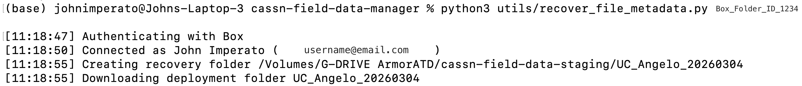

# CA-SSN Field Data Manager — Utilities

Helper scripts for maintenance and data recovery tasks.

The active lookup contract uses `site_name,site_short_name,site_code` in
`sites.csv`; `plots.csv` and curated device-level `deployments.csv` join by
`site_short_name`. `devices.csv` has no site key. Retired `cameras.csv`,
`ARUs.csv`, and event-only `deployments.csv` are not app inputs.

## `validate_curated_lookups.py`

Read-only validation for a complete candidate runtime lookup directory:

```bash
.venv/bin/python utils/validate_curated_lookups.py /path/to/lookup_directory
```

The command validates both curated CSVs, their event/device relationships, and
their authoritative site/plot references. It prints row counts and SHA-256
hashes. It does not authenticate, publish, install, copy, or modify anything.
If the path is omitted it checks the normal local lookup cache.

---

## `box_auth_setup.py`

Runs the Box OAuth setup flow and writes reusable Box tokens to
`~/.cassn_credentials/box_tokens.json`.

### When to use

Use this script the first time you connect `cassn_field_data_manager.py` to Box,
or any time your saved Box tokens stop working and need to be refreshed.

### Requirements
```bash
pip install box-sdk-gen
```

You also need `~/.cassn_credentials/config.json` with your Box app
`client_id` and `client_secret`.

To verify `box-sdk-gen` is installed:

```bash
python3 -c "import box_sdk_gen; print('box-sdk-gen ok')"
```

### Setup

1. Confirm your Box credentials file exists:
   ```bash
   ls ~/.cassn_credentials/config.json
   ```
2. If `~/.cassn_credentials/config.json` does not exist, create it from the example file:
   ```bash
   mkdir -p ~/.cassn_credentials
   cp config.json.example ~/.cassn_credentials/config.json
   ```
3. Edit `~/.cassn_credentials/config.json` and add your Box app `client_id` and `client_secret`.

### Run
```bash
python3 utils/box_auth_setup.py
```

During the OAuth flow, `box_auth_setup.py` will:

1. Open your browser to the Box authorization page.
2. Ask you to log in and grant access.
3. Ask you to paste the full redirect URL back into the terminal.
4. Exchange that authorization code for tokens.
5. Save `box_tokens.json` to `~/.cassn_credentials/`.

### Output

On success, the script writes:

```text
~/.cassn_credentials/box_tokens.json
```

That token file is then used by:

- `cassn_field_data_manager.py`
- `recover_file_metadata.py`

### Notes

- If the script finds an existing token file, it tests that connection first
- If the existing token is invalid, it falls back to a fresh OAuth flow
- Refreshed tokens are written back to `~/.cassn_credentials/box_tokens.json` automatically
- The browser may redirect to a page that does not load; that is expected
- Paste the entire redirect URL, not just the authorization code

---

## `recover_file_metadata.py`

Recovers a deployment by downloading the full Box folder to the staging drive,
then regenerating:

- `file_metadata.csv`
- `deployment_event_record.json`
- `recovery_report.json`

### When to use

Use this script when a deployment was successfully uploaded to Box but the
local metadata artifacts were missing, incomplete, or need to be rebuilt.

### Requirements
```bash
pip install Pillow box-sdk-gen
```

Pillow is required. The script fails immediately if EXIF support is unavailable.

### Setup

1. Confirm Box credentials exist in `~/.cassn_credentials/`:
   - `config.json`
   - `box_tokens.json`
   ```bash
   ls ~/.cassn_credentials/config.json ~/.cassn_credentials/box_tokens.json
   ```
2. Open [`utils/recover_file_metadata.py`](/Users/johnimperato/GitHub/cassn-field-data-manager/utils/recover_file_metadata.py) and confirm the hard-coded recovery root matches your machine:
   - `RECOVERY_ROOT = Path("/Volumes/G-DRIVE ArmorATD/cassn-field-data-staging")`
   - Change this path if you want recovered deployments written somewhere else
   ```bash
   rg -n 'RECOVERY_ROOT' utils/recover_file_metadata.py
   ```
3. Confirm that recovery path exists and is writable on your machine.
   ```bash
   ls "/Volumes/G-DRIVE ArmorATD/cassn-field-data-staging"
   ```
4. Find the Box deployment folder ID from the Box URL:
   - `https://app.box.com/folder/123456789012`
   - Use the top-level deployment folder ID, not the `raw_data` subfolder ID
5. Confirm local plot metadata exists for label recovery:
   ```bash
   ls local_data/plots.csv
   ```

### Run
```bash
python3 utils/recover_file_metadata.py BOX_FOLDER_ID
```

Replace `BOX_FOLDER_ID` with the numeric deployment folder ID from Box. 

The script recovers exactly one deployment folder per run.

Progress is printed to the terminal as files are downloaded and processed.

Example terminal output during a live recovery run:



### Output

The script creates a local recovery folder under:

```text
/Volumes/G-DRIVE ArmorATD/cassn-field-data-staging/<deployment-folder-name>/
```

That recovery folder contains:

- the downloaded Box deployment contents
- `file_metadata.csv`
- `deployment_event_record.json`
- `recovery_report.json`

If the deployment folder already exists locally, the script fails and does not overwrite it.

### Notes

- Authenticates using `~/.cassn_credentials/box_tokens.json` — no
  separate authentication step needed
- Downloads the entire deployment and preserves the Box folder structure
- Uses Box modified time for the recovered `timestamp` field
- Sets unrecoverable fields such as `original_filename` and `source_path` to `NA`
- Writes recovered outputs locally only; it does not upload `file_metadata.csv`
  or `deployment_event_record.json` back to Box
- Writes `recovery_report.json` even when the run completes with failures
- Uses `local_data/plots.csv` for plot-label lookup; `example_lookups/` files are templates only

---

## `generate_wi_deployments.py`

Generates Wildlife Insights deployment CSVs from CASSN deployment folders.

You can use it two ways:
- scan Box for deployment folders and generate WI CSVs in bulk, then upload them back to Box
- or process one local deployment folder for testing

For each deployment event, the script writes two CSVs into a `WI_metadata/`
subfolder:

- `wildlife_insights_ML_deployments.csv` — one row per ML (parallel) camera plot
- `wildlife_insights_SA_deployments.csv` — one row per SA (downward) camera plot

### When to use

- Run this after a deployment has already been uploaded to Box and you need the
  WI deployment CSVs.
- Use the local mode if you want to test one deployment folder before doing a
  broader backfill.
- If WI CSVs already exist in a deployment folder, the script skips that folder
  unless you use `--force`.

### Requirements

```bash
pip install box-sdk-gen
```

No extra dependencies beyond `box-sdk-gen`.

### Setup

This script depends on two local files in `local_data/`. These are gitignored on
purpose because they contain project IDs and camera serial numbers you do not
want committed.

#### 1. `local_data/cameras.csv`

Maps each site + plot + camera type to the camera used there, plus the few WI
fields this script needs. The script writes a skeleton from `local_data/plots.csv`
on first run when the file is absent, leaving `camera_id` and `feature_type`
blank for you to fill in.

#### 2. `local_data/wi_config.json`

Stores WI project IDs and a few deployment-level defaults. Copy the template and
fill in your values:

```bash
cp example_lookups/wi_config.json local_data/wi_config.json
```

To find your WI project ID: log in to [app.wildlifeinsights.org](https://app.wildlifeinsights.org),
open the project, and copy the number from the URL:
`wildlifeinsights.org/manage/projects/XXXXX`

### Run — Box mode (all deployments)

```bash
python3 utils/generate_wi_deployments.py
```

Traverses the Box deployment folders, downloads the deployment JSON files it
needs, generates the WI CSVs, and uploads them back to a `WI_metadata/`
subfolder in Box.

### Run — local mode (single deployment)

```bash
python3 utils/generate_wi_deployments.py --local PATH
```

Processes one local deployment folder. Writes WI CSVs to a `WI_metadata/` subfolder
inside that folder. Useful for testing before running against Box.

Example:

```bash
python3 utils/generate_wi_deployments.py --local '/Volumes/G-DRIVE ArmorATD/2026/UC_QuailRidge_20260108'
```

### Output

For each deployment event, the script creates or updates:

```text
<deployment-folder>/
└── WI_metadata/
    ├── wildlife_insights_ML_deployments.csv
    └── wildlife_insights_SA_deployments.csv
```

### Notes

- Authenticates using `~/.cassn_credentials/box_tokens.json` — no separate authentication step needed
- Only downloads `deployment_event_record.json` from Box; media files are never downloaded
- Audio device types (`BD`, `BT`) are ignored
- Missing `wi_config.json` causes the script to fail before writing output
- Missing `cameras.csv` causes warnings and blank camera-specific fields
- Existing WI CSVs are skipped unless you use `--force`

---

## `generate_occurrences.py`

Joins pre-processing file metadata (`file_metadata.csv`) with post-processing Wildlife Insights results (`images.csv`) to produce a deployment event occurrence record CSV. Each row is an animal detection with a unique file identifier, timestamp, and spatial coordinates. Blanks, humans, vehicles, and unidentified results are excluded.

### Run
```bash
python3 utils/generate_occurrences.py <file_metadata.csv> <images.csv> <output_dir>
```

### Output

```text
<output_dir>/
└── UC_SITE_YYYYMMDD_occurrences.csv
```

---

## `fix_camera_clock.py`

Corrects a camera **clock offset** on already-staged images, end to end. A camera
deployed with a wrong internal clock writes wrong timestamps into every photo's
EXIF; this rewrites the dates and keeps the deployment's QC/fixity records
consistent so the normal Box upload + hash verification still pass.

Per device, it:

1. Shifts the EXIF dates with `exiftool` (`-AllDates`, which also moves the Reconyx
   MakerNote `DateTimeOriginal`).
2. Recomputes SHA-256/SHA-1 and file size (the bytes changed, so the old hashes
   are stale).
3. Re-reads `recorded_datetime` from the corrected EXIF.
4. Patches the deployment's `session.json` file inventory.
5. Refreshes an existing legacy device manifest, if present, and regenerates
   the metadata CSVs. It never creates a new per-device manifest.

The offset is fully general — any combination of
years/months/days/hours/minutes/seconds, added or subtracted — so it handles a
wrong year, a wrong month, or a few-hours timezone/DST slip.

### When to use

Use it when a camera's clock was set wrong and the photos are already staged
locally (e.g. cameras that recorded 2025 because the clock was a year early).
Audio (`BD`/`BT`) is never affected — AudioMoth datetimes come from the
GUANO/filename, not a camera clock.

> **Close the CASSN app before running.** Its autosave would otherwise overwrite
> the corrected `session.json`.

### Requirements

`exiftool` on your PATH, plus the project's normal Python environment (the script
imports the `cassn` package).

```bash
exiftool -ver        # confirm exiftool is installed
```

### Run

Always preview with `--dry-run` first — it samples the current years and reports
what would change without writing anything:

```bash
python utils/fix_camera_clock.py \
  --deployment "/Volumes/G-DRIVE ArmorATD/.../UC_Sedgwick_20260610" \
  --devices p1_ML p2_ML p3_ML p4_ML p4_SA \
  --years 1 --only-year 2025 --dry-run
```

Drop `--dry-run` to apply. Each device folder named under `--devices` lives in
`raw_data/`.

### Speeding it up on a slow/HDD staging drive — `--scratch`

The per-file EXIF rewrite + re-hash is slow on a spinning HDD's random I/O. Pass
`--scratch <fast_dir>` (e.g. an internal SSD) and the tool, per device, copies the
device folder to that scratch dir (one sequential read the HDD handles well), does
the heavy work there, and copies the corrected files back only if they changed —
then patches the inventory/manifests/CSVs exactly as the in-place run does. The
data ends up back on the staging drive, so the app uploads from there unchanged.

`--scratch` takes any fast local path with room for **one device folder at a
time**; omit it to work in place.

```bash
python utils/fix_camera_clock.py \
  --deployment "/Volumes/G-DRIVE ArmorATD/.../UC_Sedgwick_20260610" \
  --devices p1_ML p2_ML p3_ML p4_ML p4_SA \
  --years 1 --only-year 2025 --scratch /tmp/cassn_scratch
```

### Options

| Flag | Meaning |
| --- | --- |
| `--deployment` | Deployment folder (contains `session.json` and `raw_data/`). Required. |
| `--devices` | One or more device folder names under `raw_data/`, e.g. `p2_ML p4_SA`. Required. |
| `--years/--months/--days/--hours/--minutes/--seconds` | The offset. At least one must be non-zero. |
| `--subtract` | Subtract the offset (clock was **ahead**). Default adds (clock behind). |
| `--only-year YYYY` | Only shift files whose current year matches — makes re-runs safe and supports partial recovery. |
| `--scratch DIR` | Route the heavy per-file work through this fast local dir. Omit to work in place. |
| `--dry-run` | Report what would change; write nothing. |

### Notes

- `--only-year` is the idempotency guard: with `--only-year 2025`, re-running
  won't double-shift files already corrected to 2026.
- Recomputing hashes is **mandatory**, not optional — rewriting EXIF changes the
  bytes, so without the re-hash every corrected file would (correctly) fail the
  Box hash check. The script handles this for you.
- After it finishes, the staged data, inventory, CSVs, and any legacy manifest
  still present all agree; run the app's Box upload as normal.

---

## `split_for_wi.py`

Splits oversized **camera** device folders into Wildlife-Insights-sized batches.
WI accepts at most **15,000 images per upload**, but a `pN_ML` / `pN_SA` folder
often holds far more. This tool scans a root, finds every camera folder over the
limit, and divides its images into `<device>_1`, `<device>_2` … subfolders —
each at or under the limit — so each subfolder is one WI upload.

Per device it:

1. Reads the folder's full image inventory (loose files **plus** anything already
   in `<device>_N` parts, so it can resume a half-finished run).
2. Plans parts of ≤ 15,000, never cutting a trigger burst (`…_00001_1/_2/_3`
   stay together, so each part lands at or just under the limit).
3. **Moves** each image into its part folder (no duplicate storage), then checks
   filenames and part counts without rereading image contents. Each same-volume
   file move is atomic; the complete operation is resumable rather than
   transactional. A retired legacy `<device>_manifest.json`, if present, is left
   untouched in the device root.

The reusable logic lives in `cassn/core/wi_split.py`; this file is just the CLI.

### When to use

The application now performs this preparation automatically before the first
Box upload for new deployments. Use this CLI for a dry-run preview, a controlled
retroactive split, recovery/undo, or a small-limit engine rehearsal. It does not
update `session.json`; normal app-driven uploads should use the automatic GUI
workflow so nested inventory paths stay synchronized. Audio (`BD`/`BT`) is never
touched. Point the WI uploader at each `<device>_N` subfolder in turn.

For John's production maintenance workflow, a requested retroactive split is a
**post-upload operation on the Box Drive deployment copy**. Resolve and target
the deployment below
`/Users/johnimperato/Library/CloudStorage/Box-Box/CASSN/field_data`; do not target
the G-DRIVE staging copy unless John explicitly requests that location. This
operating convention is separate from the application's automatic pre-upload
behavior for newly ingested deployments.

### Run

```bash
# Preview one uploaded deployment in Box Drive — writes nothing (default):
python utils/split_for_wi.py \
  --root "/Users/johnimperato/Library/CloudStorage/Box-Box/CASSN/field_data/2026/Jepson Prairie Reserve/UC_JepsonPrairie_20260423"

# Perform the verified split while preventing sleep:
caffeinate python utils/split_for_wi.py \
  --root "/Users/johnimperato/Library/CloudStorage/Box-Box/CASSN/field_data/2026/Jepson Prairie Reserve/UC_JepsonPrairie_20260423" \
  --apply --yes

# Put the Box Drive deployment back:
python utils/split_for_wi.py \
  --root "/Users/johnimperato/Library/CloudStorage/Box-Box/CASSN/field_data/2026/Jepson Prairie Reserve/UC_JepsonPrairie_20260423" \
  --undo
```

### Options

| Flag | Meaning |
| --- | --- |
| `--root` | Folder to scan: a season or a single deployment. For production maintenance, use the Box Drive deployment. Required. |
| `--limit N` | Max images per part (default `15000`). |
| `--suffixes` | Device-folder suffixes to target (default `_ML _SA`). |
| `--apply` | Perform the split. **Default is a dry-run report.** |
| `--undo` | Reverse a previous split under `--root`. |
| `--no-keep-bursts` | Allow a part boundary to fall inside a trigger burst. |
| `--yes` | Skip the confirmation prompt on `--apply` / `--undo`. |

### Notes

- **Idempotent / resumable.** Re-running `--apply` only moves images not yet in
  their planned part, so an interrupted run (crash, quit, disk sleep) is finished
  by simply running it again; a completed split is a no-op. A big move on a
  spinning HDD can take a while — that's disk speed, not a hang.
- **Reversible.** `--undo` moves every part's images back up and removes the
  emptied part folders. A round-trip restores the folder exactly.
- **Verified.** A completed split is accepted only when every planned filename
  appears exactly once, no image remains loose, and every part respects the
  configured limit. Invalid limits, duplicate names, and destination collisions
  stop with an error rather than overwriting or silently skipping a file.
- **Safe against re-matching.** Part folders (`p1_ML_1`) never end in `_ML` /
  `_SA`, so re-scans can't recurse into prior output.
- **Run only after the original upload completes.** Do not overlap the split
  with the initial Box upload or another maintenance utility. When the Box Drive
  copy is the target, Box Drive will synchronize the verified moves afterward;
  keep it running and keep the Mac awake until the server catches up.
- **Avoid unaffected large folders.** Use `image_file_metadata.csv` to identify
  oversized ML/SA devices first. For a large Box Drive deployment, expose only
  those device folders through temporary symlinks under `/tmp`, run the dry-run
  and apply against that selector root serially, then remove the symlinks. The
  symlinks select targets; all moves still occur inside Box Drive.

---

## `prep_soundhub.py`

Stages and uploads **bird (BD)** audio to Wildlife SoundHub. The application can
add deployment events to the cumulative local batch as they are processed, then
wait until the desired group is ready for one transfer. This CLI provides the
same workflow for the backlog—deployments downloaded and pushed to Box before
the SoundHub step existed. Both paths call the same submission code in
`cassn/soundhub/`.

Replaces the retired `convert_to_flac.py` and `verify_flac_conversion.py`. Those
rebuilt each `deployment_id` by parsing folder names, a derivation that dropped
the organization prefix (`StrathearnRanch_plot1_BD_...` instead of
`UC_StrathearnRanch_plot1_BD_...`). Since the SoundHub IAM role has no
`DeleteObject` permission, that would have written S3 keys nobody on our side
could remove. The deployment id now comes from `audio_file_metadata.csv`, which
carries it straight from the curated device row.

### When to use

- Preparing deployments already in Box that have never been sent to SoundHub.
- Re-running a partial staging or a partial upload — both are resumable.
- Checking what is staged before pushing anything.

Bat (BT) audio is never touched; it is destined for NABat.

### Requirements

```bash
pip install boto3
brew install flac      # macOS; see https://xiph.org/flac elsewhere
```

AWS credentials come from the standard chain, not from the app. Confirm the
identity before a first push:

```bash
aws sts get-caller-identity
```

### Run

```bash
# Stage one deployment: BD WAVs → FLAC, then rebuild the project CSVs
python utils/prep_soundhub.py stage --deployment "/path/to/UC_QuailRidge_20260108"

# Stage every deployment under a season folder
python utils/prep_soundhub.py stage --root "/path/to/2026"

# Review what is staged and where it will land in S3
python utils/prep_soundhub.py status

# Validate staged-to-Box provenance mapping without S3 or Box writes
python utils/prep_soundhub.py upload --preflight-only

# Push, verify, update Box provenance, and write a Markdown submission report
python utils/prep_soundhub.py upload

# Reconcile staging against the bucket without transferring anything
python utils/prep_soundhub.py upload --verify-only
```

### Options

| Flag | Meaning |
| --- | --- |
| `--staging DIR` | Staging root. Defaults to `soundhub.staging_root` in `~/.cassn_config/config.json`. |
| `stage --deployment PATH` | One deployment folder. |
| `stage --root PATH` | Scan below this folder for every deployment with an `audio_file_metadata.csv`. |
| `upload --verify-only` | Skip the transfer; only reconcile staging against the bucket. |
| `upload --preflight-only` | Validate exact staged-FLAC coverage in Box metadata without S3 or Box writes. |
| `upload --box-year-root DIR` | Override the automatically inferred standard Box Drive `field_data/<year>` folder. |
| `upload --submitter NAME` | Override the default submitter, `Imperato, John`. |
| `clear-completed` | Read-only cleanup preflight for a fully submitted local batch. |
| `clear-completed --apply` | Delete the preflighted derived staging project after SoundHub acceptance. |

### Output

```text
<staging_root>/
├── UCNature-SSN/                     # Mirrors the S3 prefix exactly
│   ├── deployment.csv
│   ├── recording.csv
│   └── UC_QuailRidge_plot1_BD_20260118/
│       └── UC_QuailRidge_plot1_BD_20260118_00001.flac
└── .cassn_fragments/                 # Never uploaded — per-deployment CSV rows
    └── UC_QuailRidge_plot1_BD_20260118/
```

Both CSVs are also written to the deployment folder's own `soundhub/` subfolder,
so the submission travels to Box alongside the raw data.

### Notes

- **Source WAVs are never modified.** FLAC is written to the staging tree only.
- **Idempotent.** An existing FLAC is left alone, and re-staging a deployment
  replaces its rows in the project CSVs rather than duplicating them. An
  interrupted run is finished by running it again.
- **The project CSVs are cumulative.** They live at the project root in S3, not
  per deployment, and are rebuilt from every fragment in staging on each run.
- **Verify immediately after uploading.** SoundHub drains its `upload/` prefix
  once it ingests a submission, so a later listing shows nothing. That is normal
  and is not an upload failure — the durable record is the
  `is_submitted_to_soundhub` column in `audio_file_metadata.csv`.
- **Exact Box provenance.** Before upload, every staged FLAC must map to exactly
  one BD audio row in Box. After verification, only those rows receive the
  SoundHub submission fields. Header-only failures and other unstaged rows stay
  unsubmitted. The same concise Markdown report is saved into every affected
  Box deployment event's `soundhub/` folder with the destination, counts,
  manifest hashes, and verification result.
- **Automatic year selection.** The normal Box Drive `field_data/<year>` folder
  is inferred from the staged deployment IDs, including future years. A staging
  tree containing multiple years is rejected; `--box-year-root` is only for a
  nonstandard Box location, not routine year selection.
- **No accidental historical re-upload.** Backlog media already marked as
  submitted on Box closes the current local batch. The GUI and CLI refuse to
  append new deployments until that completed batch has been deliberately
  cleared, so a later submission cannot mix pending media with old manifests.
- **Guarded local rollover.** `clear-completed` verifies zero pending rows, exact
  Box provenance, one shared verified report across every represented event,
  the cleanup path, file count, and bytes. It is a dry run unless `--apply` is
  supplied, and it revalidates immediately before deleting both the local
  project mirror and `.cassn_fragments` rebuild inputs. It does not confirm
  SoundHub ingestion, so apply it only after acceptance is confirmed. Box, S3,
  source WAVs, and reports are untouched.
- **Uploads cannot be undone.** The role has `PutObject` and `ListBucket` but no
  `DeleteObject`. Use `status` before `upload`, and push one deployment first
  when the structure is in any doubt.

---

## `normalize_soundhub_coordinates.py`

Normalizes latitude and longitude to exactly eight decimal places in an
existing SoundHub staging tree. The utility updates both the cumulative project
`deployment.csv` and its durable per-deployment copies under
`.cassn_fragments/`; otherwise a later manifest rebuild would restore the old
coordinates. The hidden fragment directory is outside the S3 mirror and is
never uploaded.

The default is a read-only dry run. Blank, invalid, non-finite, or out-of-range
coordinates are blocking errors, as are schema problems or any non-coordinate
difference between the project manifest and its fragments.

```bash
# Preview the configured SoundHub staging tree:
python utils/normalize_soundhub_coordinates.py

# Preview an explicitly selected staging tree:
python utils/normalize_soundhub_coordinates.py \
  --staging /Users/example/cassn/soundhub/s3_upload_staging

# Apply the reported coordinate-only changes atomically:
python utils/normalize_soundhub_coordinates.py --apply
```

Fragment files are replaced first and the cumulative project manifest last, so
an interrupted run is safely resumable. `recording.csv`, staged FLACs, Box
deployment copies, source metadata, canonical lookups, and the ingest app are
not modified. Rerun the dry run after applying and require zero pending changes
before uploading.

---

## `backfill_soundhub_fields.py`

Repairs the approved pre-upload SoundHub metadata fields in one synchronized,
dry-run-first operation. It updates the cumulative and fragment deployment
manifests plus the matching Box Drive `audio_file_metadata.csv` and
event-local `soundhub/deployment.csv` copies. The repair standardizes
`subproject`, writes the literal subproject naming methodology, fills the
Survey123-supported `metal_pole` mounting value, and restores the four known
Anza-Borrego BD sensor heights. It never opens or changes media or
`recording.csv`.

```bash
python utils/backfill_soundhub_fields.py \
  --box-year-root "/path/to/Box/CASSN/field_data/2026"

python utils/backfill_soundhub_fields.py \
  --box-year-root "/path/to/Box/CASSN/field_data/2026" \
  --apply
```

## `backfill_anza_soundhub_durations.py`

Recovers the 48 missing legacy Anza-Borrego recording durations directly from
the staged FLAC STREAMINFO headers. It synchronizes the duration column in the
Box event's `audio_file_metadata.csv` with the `end` values in the cumulative
staging manifest, four per-deployment fragments, and Box event-local SoundHub
copy. The three 488-byte header-only WAV failures remain documented but blank.
Audio bytes, filenames, identifiers, starts, and deployment dates are untouched.

The default is a dry run:

```bash
python utils/backfill_anza_soundhub_durations.py \
  --box-event-root "/path/to/UC_AnzaBorrego_20260516"
python utils/backfill_anza_soundhub_durations.py \
  --box-event-root "/path/to/UC_AnzaBorrego_20260516" \
  --apply
```

Rerun the dry run after applying and require zero pending changes.

---

## `normalize_wi_coordinates.py`

Updates latitude and longitude in existing Wildlife Insights deployment CSVs
to exactly eight decimal places. Values with fewer decimal places are padded
with trailing zeroes; values with greater precision are rounded. Source lookup
tables and general image metadata are not modified.

The utility accepts one CSV, one deployment folder, or a broader root such as a
Box year folder. Directory scans only select files matching
`WI_metadata/wildlife_insights_*_deployments.csv`.

```bash
# Preview every applicable WI CSV below the 2026 Box folder:
python utils/normalize_wi_coordinates.py \
  "/Users/example/Library/CloudStorage/Box-Box/CASSN/field_data/2026"

# Apply the reported changes:
python utils/normalize_wi_coordinates.py \
  "/Users/example/Library/CloudStorage/Box-Box/CASSN/field_data/2026" \
  --apply
```

The default dry run writes nothing. With `--apply`, each changed CSV is written
to a temporary file in the same directory and atomically replaced only after
the complete output is safely flushed. Blank or invalid coordinates are left
unchanged and reported as warnings.
